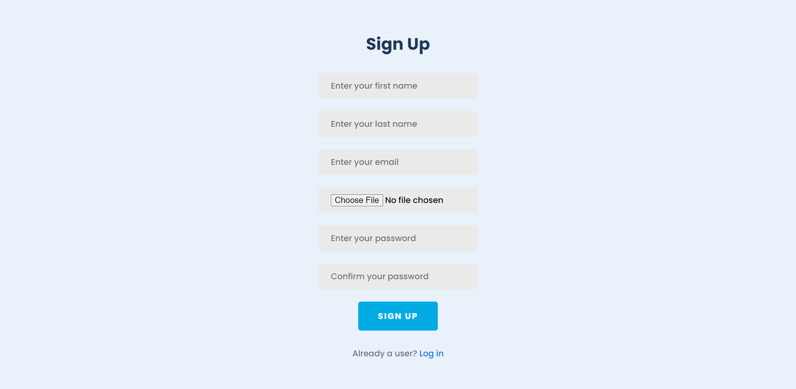
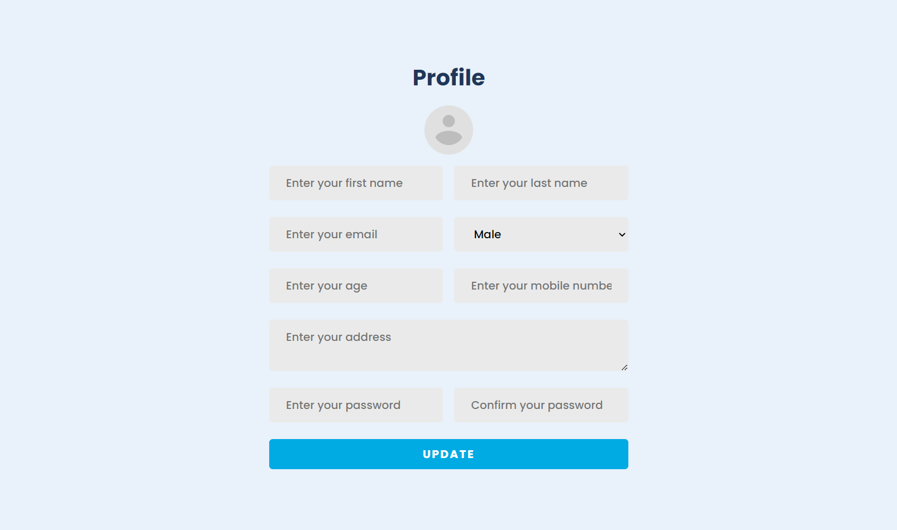
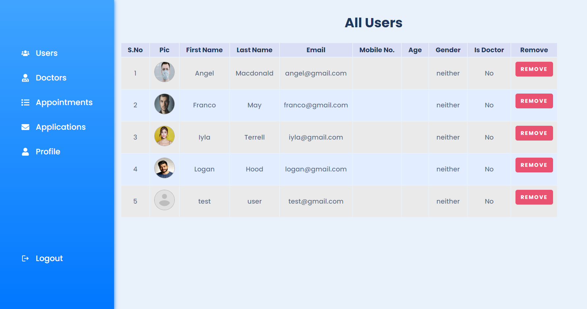

<h3>📝Description: </h3> 
Hey! This website offers a seamless experience for users and doctors alike. Sign up or log in to unlock a range of features. Easily browse through a list of available doctors, manage your profile, and submit queries effortlessly. Stay updated with notifications and enjoy secure access to your information. Aspiring doctors can apply through user-friendly system. Book appointments with your preferred doctors and track their completion status. Admin features ensure smooth operations, including approval of doctor applications and user management. Rest assured, all data is stored securely. Join us to experience a new era of convenient and efficient healthcare interactions.
<h3>📙Features: </h3>
The platform offers a wide range of features to create a user-centric and efficient healthcare experience. Users can easily register and log in, ensuring a personalized journey. They have access to a directory of available doctors, simplifying the process of finding the right medical professional. The option to update profiles keeps information current and accurate.

For user engagement and support, a dedicated contact section allows users to make inquiries. A notifications tab keeps users informed about updates, appointments, and application statuses, enhancing communication.

The presence of an admin management system is crucial for overseeing users, appointments, and doctor applications, ensuring the smooth operation of the platform. Access control features restrict certain sections to logged-in users, guaranteeing data privacy and security.

Users can apply to become doctors, expanding the pool of medical professionals on the platform. They can also easily book appointments with their preferred doctors. Admin approval for doctor applications ensures that only qualified professionals are listed.

The platform allows admin to remove users or doctors when necessary to maintain the platform's integrity. Appointment marking by doctors and admin ensures proper record-keeping. Notifications for application statuses and appointment updates facilitate effective communication.

All data is securely stored in a database, ensuring data integrity and easy retrieval. The emphasis on data security guarantees that sensitive medical information is protected, providing users with a reliable and safe healthcare platform.

<h2>ScreenShots of WebPages: </h2> 
<h3>Home Page:</h3>

### Sign up page

### Sign in page

### Profile page

### All Doctors page

### Apply for doctor page

### Admin all users dashboard

### Admin all applications page

### Book Appointment page

### Users all appointments page

### Doctors all appointments page

### Notifications page

